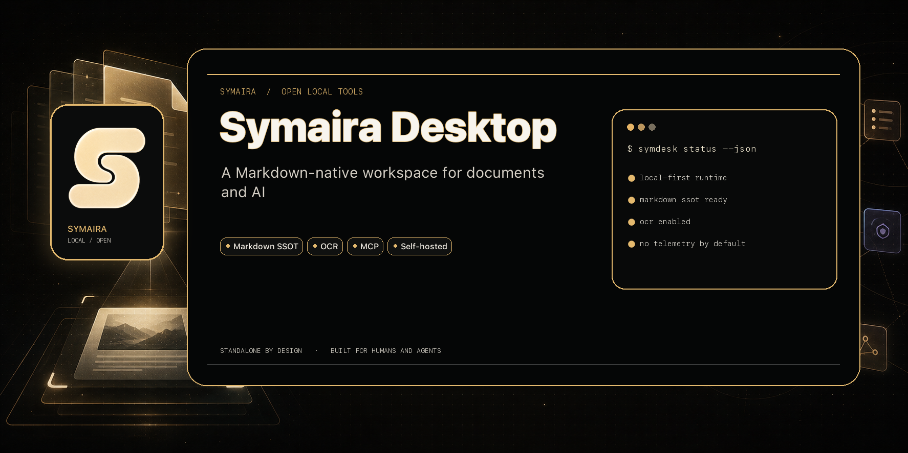
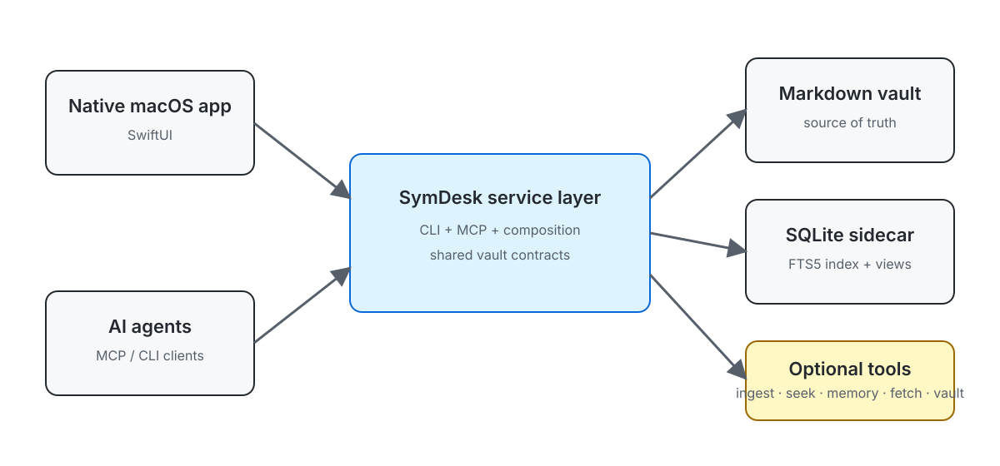

# Symaira Desktop

[](https://github.com/danieljustus/symaira-desktop/actions/workflows/ci.yml)
[](https://github.com/danieljustus/symaira-desktop/releases)
[](https://go.dev/dl/)
[](LICENSE)



The composition **shell** of the [Symaira](https://github.com/danieljustus?tab=repositories&q=symaira) ecosystem.

A local-first and self-hostable, **agent-native** workspace that unifies documents, notes, knowledge and AI over a single plain-Markdown vault. It is the realization of the "Paperless + Obsidian + Notion AI" dream as *one surface*, deliberately **not** a monolith and without making a proprietary database the source of truth.

**Status:** Working MVP — Go core (`symdesk`) with CLI, stdio MCP, SQLite/FTS5 sidecar, vault contract v2 ([VAULT.md](VAULT.md)), authenticated HTTP API, durable document queue, Docker deployment, and distributed Tesseract/Ollama OCR workers. The native macOS app provides a live dashboard, editing, sidebar note creation, full-text search, link graph, saved views, document workflow, ingest, companion tools installer, and previews in local and server-connected modes. The iOS companion provides cached on-device search, document filters, Markdown reading, and native Quick Look previews from either Files/iCloud or a connected server. Not yet complete Paperless-ngx parity — the self-hosted path covers central originals, Markdown, index, upload queue, remote OCR, native clients, IMAP mail ingestion, users/groups/document-level permissions, storage-path templating and retention rules, and expiring share links; a browser admin UI remains future work. For recovery guidance, see [BACKUP.md](BACKUP.md).

`symdesk` is a Go core that can run as a **CLI**, **MCP server**, authenticated **self-hosted document server**, or distributed **OCR worker**. Native SwiftUI apps for macOS and iPhone/iPad can either open a local/iCloud vault directly or connect to the self-hosted server as frontends.

- **Owns:** the Markdown-as-SSOT vault contract, one SQLite sidecar index, the native app, and the runtime composition layer
- **Composes at runtime today:** [`symmemory`](https://github.com/danieljustus/symaira-brain) (RAG/graph — built by `symaira-brain`), [`symbrowse`](https://github.com/danieljustus/symaira-browse) (web clipping — includes the former `symfetch`), and [`symvault`](https://github.com/danieljustus/symaira-vault) (secrets resolution), all detected dynamically via `PATH` probe (the core never depends on their presence and degrades gracefully).
- **Ships in-repo:** the tools absorbed by the repo consolidation live here as [`meet/`](meet/) (meeting capture, macOS app target) and directly in the root module as [`internal/pdf/`](internal/pdf/) (Markdown → PDF, former `symaira-print`), [`internal/contacts/`](internal/contacts/) (contact references, former `symaira-relate`), [`internal/retrieval/`](internal/retrieval/) (hybrid search, former `symaira-seek`), [`internal/ingest/`](internal/ingest/) (OCR/ingest, former `symaira-ingest`), and [`internal/room/`](internal/room/) + [`cmd/symroom`](cmd/symroom) (signed project journal, former `symaira-room`). PDF rendering, contact references, hybrid search, ingest, and the room logic are linked into `symdesk` in-process, so there is no separate `symprint`, `symrelate`, `symseek` or `symingest` binary to install any more. Meet is the exception: its module lives here and its libraries are available to the app, but recording still runs in the separate SymMeet menu-bar agent, which SymDesk brings forward rather than links against — SymDesk itself never captures audio. Room is the second exception: it ships as the `symroom` binary (built from the root module since the 2026-08 module dissolution), and its SwiftUI module in [`room/client/`](room/client/) is embedded in the app as the Project Journal surface, which bridges that binary rather than linking Go code. See `docs/repo-konsolidierung.md` §10 in the workspace.
- **Runs on:** macOS, Linux amd64/arm64, Docker/Compose, Raspberry Pi, Mac mini, NAS-class hosts, and Home Assistant OS as an app/add-on
- **Delegates (does not rebuild):** spreadsheets → LibreOffice; code editing → editor plugins + agent orchestration; Obsidian Canvas/whiteboards → Obsidian; iCloud sync → the OS
- **Language:** Go (CGO-free, core) + Swift/SwiftUI (app). **License:** Apache-2.0



## Status and stability

Symaira Desktop is in **active development and pre-1.0**: the `symdesk` CLI,
MCP tools, vault contract and `/api/v1` server contract are stabilizing but
may still change between releases. The current release is a working MVP — see
the status summary above for what works today. Per-release notes are in
[release-notes.md](release-notes.md) and on the
[GitHub Releases](https://github.com/danieljustus/symaira-desktop/releases)
page; the near-term roadmap is in [docs/PLAN.md](docs/PLAN.md).

## Why Symaira Desktop

- One plain-Markdown vault remains the source of truth instead of locking data into a proprietary database.
- The CLI, MCP server, and native macOS app share the same service layer and contracts.
- Symaira tools are composed at runtime, so optional capabilities degrade gracefully when a companion tool is unavailable.
- Local-first and self-hosted modes both keep documents, indexes, and configuration under the user’s control.
- OCR jobs can run beside the server or be leased to a stronger Mac/Linux worker, including a MacBook using a local Ollama vision model.

## Installation

### CLI from GitHub Releases

Download the archive for your platform from the [latest GitHub Release](https://github.com/danieljustus/symaira-desktop/releases/latest), extract it, and place `symdesk` on your `PATH`.

### CLI from source

```sh
go install github.com/danieljustus/symaira-desktop/cmd/symdesk@latest
```

### Native macOS app from source

The SwiftUI app currently builds from source on macOS 14 or newer:

```sh
brew install xcodegen
xcodegen generate
xcodebuild build -project SymDesk.xcodeproj -scheme SymDesk -destination 'platform=macOS'
```

### Native iPhone/iPad app from source

The mobile companion supports iOS 18 or newer. Generate the project, open it in
Xcode, choose your development team for the `SymDeskMobile` target, and run it
on an iPhone or iPad:

```sh
xcodegen generate
open SymDesk.xcodeproj
```

On first launch, choose a vault in Files/iCloud or enter a SymDesk Server URL
and token. Server snapshots are searched on-device and originals are downloaded
only when a preview is opened.

## Usage

```sh
export SYMDESK_VAULT=~/Vault   # or configure via config file / --vault

symdesk index                  # index the vault into the sidecar
symdesk ls                     # list notes
symdesk search "invoice 2026"  # FTS5 full-text search
symdesk note new "My Note"     # create a note (frontmatter per vault contract)
symdesk props <file>           # frontmatter properties
symdesk backlinks <file>       # incoming wikilinks
symdesk graph                  # nodes + edges for the link graph
symdesk relations inverse <file>  # notes that reference a file via properties/wikilinks
symdesk relations related <file>  # related entities and notes for a file (alias: `related <file>`)
symdesk views ...              # saved database views
symdesk ingest <file>          # copy a document into inbox/ + create a stub note
symdesk ingest reocr <archive-path>  # re-run OCR/extraction for an already-ingested document (or --document-id)
symdesk rules list|add|update|delete|test|dry-run  # manage document classification rules
symdesk mail rules list|create|update|delete       # manage configured IMAP mail accounts (create/update read JSON from stdin)
symdesk ask "question?"        # AI answer grounded in vault search results
symdesk meeting import <id>    # import a reviewed SymMeet meeting as a vault note (runtime-only, optional)
symdesk meeting list           # list imported meeting notes
symdesk meeting show <file>    # show one imported meeting note
symdesk meeting refresh <file> [--apply]  # preview (or apply) a transcript re-export
symdesk events --json          # NDJSON change stream (used by the app)
symdesk recipe validate .symdesk/recipes/daily.yml  # validate automation without running it
symdesk recipe run .symdesk/recipes/daily.yml       # stage runner proposals for review
symdesk recipe diff <run-id>                         # inspect proposed files
symdesk recipe accept <run-id>                       # apply an approved proposal
symdesk mcp                    # stdio MCP server for agents
symdesk serve                  # authenticated self-hosted API + durable queue
symdesk worker --server ...    # remote Tesseract/Ollama OCR worker
symdesk doctor                 # health check
symdesk config path            # resolved config file path
symdesk config get [key]       # print resolved configuration (all keys or one)
symdesk config set <key> <value>  # update a config value
symdesk config init            # create the default config file
symdesk version --json         # {"tool":"symdesk","version":...,"schema_version":1}

## CLI sample

```text
$ symdesk version --json
{"tool":"symdesk","version":"0.8.0","schema_version":1}
```

## Development

```sh
make build          # → bin/symdesk
make test           # go test -race ./...
make lint           # gofmt + go vet + corekit-guard + boundary-guard
make benchmark-large # generate and index a deterministic 10k-document vault
docker compose build # multi-architecture-compatible Linux server/worker image
```

### macOS app (requires xcodegen)

```sh
xcodegen generate
xcodebuild build -project SymDesk.xcodeproj -scheme SymDesk -destination 'platform=macOS'
```

## Document workflow (vault contract v2)
symdesk docs list --type invoice          # list indexed documents, with filters
symdesk docs review                       # list documents needing review (low-confidence / missing metadata)
symdesk docs status <file> paid           # set document status (open|paid|submitted|done|...) (alias: `doc status`)
symdesk docs due <file> 2026-12-31        # set document due date (ISO-8601) (alias: `doc due`)
symdesk duplicates                        # list groups of possible duplicate documents (SimHash)
symdesk duplicates similar <file>         # find near-duplicates of one file (alias: `similar <file>`)
symdesk demo init [dir]                   # materialise the built-in demo vault
symdesk demo init --size large [dir]      # materialise a deterministic 10k-document benchmark vault
```

All commands support `--json` for machine-readable output.

### Command groups and retired aliases

`symdesk --help` groups every command under **Vault**, **Document**, **AI**,
**Server**, and **Maintenance** headings instead of one flat alphabetical
list. Four pairs of near-synonym commands were collapsed into one command
each with subcommands; the old names still work exactly as before (same
flags, same `--json` output) but no longer appear in `--help`:

| Current command | Retired hidden alias |
| --- | --- |
| `docs status` / `docs due` / `docs type` / `docs correspondent` / `docs tag` / `docs asn` | `doc status` / `doc due` / `doc type` / `doc correspondent` / `doc tag` / `doc asn` |
| `duplicates similar <file>` | `similar <file>` |
| `relations related <file>` | `related <file>` |

`note` and `notebook` remain separate commands (different concepts), just
grouped together under **Vault**.

### Large-vault performance baseline

Run `make benchmark-large` on a quiet machine to measure one complete index and
search pass over the deterministic 10,000-document fixture. Record the result
with the machine model and Go version before comparing changes; the target is
intended for explicit performance checks, not routine CI. The core budget is a
typical search below 100 ms after indexing. App measurements (grid scrolling,
graph render, and viewer-open time) remain manual because they depend on the
host GPU and the native app runtime.

Baseline (2026-07-11): Apple M4 Pro, Go benchmark harness, one index-and-search
pass: **3.44 s** (`BenchmarkLargeVaultIndexAndSearch`, `-benchtime=1x`).

Baseline (2026-07-19): Apple M4 Pro, Go 1.26.5, one `symdesk graph` pass over
the same fixture with Memory entities present: **488 ms**
(`BenchmarkGraphLargeVaultWithEntities`, `-benchtime=1x`). Previously this scaled
with entities × documents because each entity re-parsed every vault file from
disk; the graph endpoint now parses each file once per call and reuses it
across all matched entities.

### Reviewed recipes (optional)

Recipes live in `.symdesk/recipes/*.yml`. They declare an allowed trigger, an
explicit tool allow-list, and a hard `write_cap`. `symdesk` delegates execution
to the runner named by `recipe_runner` (config or `SYMDESK_RECIPE_RUNNER`)
through a versioned JSON request/response contract; the runner can only
propose file contents. No runner ships by default — without `recipe_runner`,
`validate` and `accept` still work and `run` reports that none is configured. Each run is retained in
`.symdesk/runs/<id>/` as JSON plus a readable Markdown trace. No proposal
changes the vault until `symdesk recipe accept <id>` is invoked; rejected runs
remain available for inspection.

### AI (optional, local-first or cloud)

`symdesk ask` and `symdesk transform` support both local models via Ollama and cloud providers (Anthropic Claude). If no provider is configured, the system degrades honestly by explaining the missing configuration and returning search results.

#### Local AI (Ollama)

To use a local model, configure the Ollama endpoint and model name:

```sh
export SYMDESK_LLM_PROVIDER=ollama      # default
export SYMDESK_OLLAMA_URL=http://localhost:11434
export SYMDESK_OLLAMA_MODEL=llama3.2     # optional, default llama3.2
```

The answer language is selected from the query by default. Set `language` in
the config file or use `SYMDESK_LANG` to force a language for both `ask` and
`transform`:

```sh
export SYMDESK_LANG=English
```

#### Cloud AI (Anthropic Claude)

To use Anthropic's Claude models, set the provider, model, and API key:

```sh
export SYMDESK_LLM_PROVIDER=anthropic
export SYMDESK_LLM_MODEL=claude-sonnet-5  # optional, default claude-sonnet-5
```

Anthropic output is limited to `max_tokens = 8192` by default. Override it in
the config file or with `SYMDESK_MAX_TOKENS`. If Anthropic stops at that limit,
the stream ends with an explicit output-truncated notice instead of silently
cutting off.

The API key (`SYMDESK_LLM_API_KEY`) is resolved dynamically in priority order:

1. **Environment Variable**: Directly set `SYMDESK_LLM_API_KEY`.
2. **Symvault (1Password)**: If `symvault` is installed on your `PATH`, you can set the key to a `symvault` secret reference:
   ```sh
   export SYMDESK_LLM_API_KEY="op://vault/item/llm-api-key"
   ```
3. **macOS Keychain Fallback**: If no key is set in the environment, `symdesk` checks the macOS Keychain for a password under service `symaira-desktop` and account `llm-api-key`. You can store it using:
   ```sh
   security add-generic-password -s symaira-desktop -a llm-api-key -w "your-api-key-here"
   ```

## What can be built and connected?

| Artifact | Build/run target | Storage and processing | Connects to |
| --- | --- | --- | --- |
| `symdesk` CLI/MCP | macOS, Linux, Windows; amd64/arm64 | Local vault and optional Symaira tools | Shell, agents, native Mac app |
| SymDesk Server container | Docker/Compose on Mac mini, Raspberry Pi 4/5 (64-bit), Linux server or NAS | Owns vault, originals, FTS index and durable OCR queue | Mac app, iOS app, workers |
| Home Assistant app/add-on | Home Assistant OS on aarch64/amd64 | Persistent `/data/vault`; optional in-container Tesseract | Mac app, iOS app, remote workers |
| Remote OCR worker | macOS or Linux | Downloads one leased original, runs Tesseract or local Ollama, returns text | One SymDesk Server |
| `SymDesk.app` | macOS 14+ | Direct local vault **or** native server frontend; edits and uploads | Local CLI or SymDesk Server |
| SymDesk for iPhone/iPad | iOS/iPadOS 18+ | Direct Files/iCloud reader **or** cached server frontend | Files provider or SymDesk Server |

The server and clients use the same versioned `/api/v1` contract. Access tokens
are stored in Apple Keychain. A plain HTTP server should only be used on a
trusted LAN; use HTTPS or a VPN for access outside it.

## Self-hosting quick start

Create a random token and start the server:

```sh
export SYMDESK_SERVER_TOKEN="$(openssl rand -hex 32)"
docker compose up -d symdesk-server
```

The persistent vault and server state are stored in `./data`. Connect the Mac
or iOS app to `http://SERVER-IP:8787` with the same token. Do not forward that
plain HTTP port directly to the internet.

To process OCR on the server with Tesseract:

```sh
docker compose --profile local-processing up -d
```

To keep a Raspberry Pi or Mac mini focused on storage and run OCR through
Ollama on a MacBook instead, give the worker its own credential instead of
reusing the client/admin token — a worker token can only lease, download and
complete OCR jobs, not read or write arbitrary vault files:

```sh
export SYMDESK_WORKER_TOKEN="$(openssl rand -hex 32)"
docker compose up -d symdesk-server  # picks up SYMDESK_WORKER_TOKEN automatically

ollama pull gemma3
symdesk worker \
  --server http://SERVER-IP:8787 \
  --token "$SYMDESK_WORKER_TOKEN" \
  --engine ollama \
  --ollama-model gemma3
```

Existing single-token deployments keep working unchanged: leave
`SYMDESK_WORKER_TOKEN` unset and workers can keep authenticating with
`SYMDESK_SERVER_TOKEN` during the migration. See
[Self-hosting SymDesk](docs/SELF_HOSTING.md) for the full migration path.

The worker may come and go. Pending jobs remain on the server, expired leases
are recovered, and no network share needs to be mounted on the MacBook. For a
full Docker command, Home Assistant installation, storage layout, HTTPS advice,
backup notes and worker options, see [Self-hosting SymDesk](docs/SELF_HOSTING.md).

