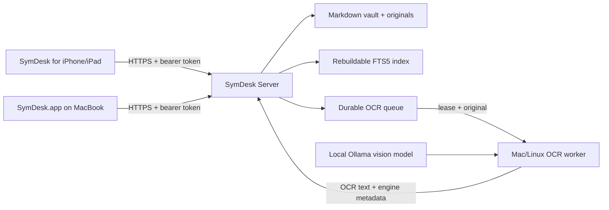

# Self-hosting SymDesk

SymDesk can keep the vault, archived originals, index and processing queue on one always-on machine while the native Mac and iOS apps act as frontends. OCR does not have to run on that server: a MacBook or another Linux/Mac machine can lease jobs, process them with Tesseract or a local Ollama vision model, and return only the extracted text.

## Architecture



The Markdown vault and archived files remain the source of truth. SQLite is a rebuildable index. Queue records are JSON files under the hidden server-state directory, so they survive container restarts.

## Storage layout

With the supplied container, `/data` is the persistent volume:

```text
/data/
  vault/
    archive/YYYY/MM/       original uploads
    inbox/                 generated Markdown notes awaiting review
    .symdesk/server/       queue records and the server-side index
  state/                   XDG application state
```

Back up the complete `/data` volume. The important user data is the readable `vault/`; the index can be rebuilt.

## Docker Compose

```sh
git clone https://github.com/danieljustus/symaira-desktop.git
cd symaira-desktop
export SYMDESK_SERVER_TOKEN="$(openssl rand -hex 32)"
docker compose up -d symdesk-server
curl http://127.0.0.1:8787/healthz
```

The server image runs as UID 10001, drops Linux capabilities in Compose, and requires a token of at least 32 characters. If a bind mount already exists, make sure UID 10001 can write `./data`.

Run a Tesseract worker beside it when the server is powerful enough:

```sh
docker compose --profile local-processing up -d
```

The profile is intentionally opt-in. On a small Raspberry Pi, leave it off and use a remote worker.

## Plain Docker

```sh
docker build -t symdesk-server .
docker run -d --name symdesk \
  --restart unless-stopped \
  -p 8787:8787 \
  -e SYMDESK_SERVER_TOKEN="$SYMDESK_SERVER_TOKEN" \
  -v "$PWD/data:/data" \
  symdesk-server
```

The same multi-architecture image runs on Linux `amd64` and `arm64`, including 64-bit Raspberry Pi OS and Apple-silicon container hosts.

Published Home Assistant and GHCR installs use matching release tags. For
example, app version `0.7.0` pulls `ghcr.io/danieljustus/symaira-desktop:0.7.0`;
the container workflow publishes that tag when release tag `v0.7.0` is pushed.

## Home Assistant OS

The repository contains `repository.yaml` and the app definition under `home-assistant-addon/symdesk/`.

1. In Home Assistant, open **Settings → Apps → App store**.
2. Add `https://github.com/danieljustus/symaira-desktop` as a repository.
3. Install **SymDesk Server**.
4. Set a random `server_token` with at least 32 characters.
5. Keep **Process OCR on this server** disabled on a weak Raspberry Pi; expose port 8787 only to the trusted LAN/VPN.
6. Connect the Apple apps to `http://HOME-ASSISTANT-IP:8787` with the same token.

Home Assistant persists `/data` and supplies settings in `/data/options.json`; `symdesk serve` reads those options directly. The app supports `aarch64` and `amd64`.

## Remote OCR on a MacBook

Install `symdesk` and choose one engine.

Tesseract is predictable and lightweight:

```sh
brew install tesseract tesseract-lang poppler
symdesk worker \
  --server http://SERVER-IP:8787 \
  --token "$SYMDESK_SERVER_TOKEN" \
  --engine tesseract \
  --ocr-language deu+eng
```

Ollama can use a vision model for difficult layouts:

```sh
ollama pull gemma3
symdesk worker \
  --server http://SERVER-IP:8787 \
  --token "$SYMDESK_SERVER_TOKEN" \
  --engine ollama \
  --ollama-url http://127.0.0.1:11434 \
  --ollama-model gemma3
```

PDF pages are rendered locally with `pdftoppm`; neither Ollama nor Tesseract needs access to the server filesystem. A lease expires after 15 minutes and is returned to the pending queue if a worker disappears. `--once` is useful for schedulers and debugging.

## Native server without Docker

```sh
export SYMDESK_VAULT=/srv/symdesk/vault
export SYMDESK_SERVER_TOKEN="$(openssl rand -hex 32)"
symdesk serve --listen 0.0.0.0:8787
```

The default bind is `127.0.0.1:8787`; listening on all interfaces must be explicit (the container sets it for you). Native TLS is available with `--tls-cert` and `--tls-key`, although a well-maintained reverse proxy or trusted VPN is usually easier.

## Connect the Apple apps

- On macOS onboarding, choose **Self-hosted SymDesk Server**. The Mac app then routes list, search, editing, document metadata, AI commands and uploads through the server API. Remote originals are cached only when opened for preview.
- On iPhone/iPad onboarding, choose **Connect to SymDesk Server**. The app downloads a compact Markdown snapshot for fast on-device search and fetches originals on demand for Quick Look.
- Tokens are stored in Apple Keychain, not UserDefaults.
- Local/iCloud mode remains available in both apps and does not require a server.

The iOS server client is currently a reader. Uploading and editing from iOS, background push refresh and offline write conflict resolution are not implemented yet.

## Security

- Every `/api/v1` endpoint requires a bearer token; only `/healthz` is public and contains no vault details.
- Use a unique token with at least 32 random characters.
- Vault-relative paths are canonicalized and checked against symlink/path traversal.
- Uploads are limited to 100 MiB; Markdown writes, OCR results and command output have separate limits.
- Remote CLI compatibility uses an explicit command allowlist. `serve`, `worker`, `mcp`, `ingest` with server-local paths, exports to arbitrary paths and demos cannot be invoked remotely.
- There is deliberately no permissive CORS configuration.
- Do not expose plain HTTP directly to the internet. Use HTTPS through a reverse proxy or a trusted VPN such as Tailscale/WireGuard.

This is a single-user/self-hosted security model. It does not provide tenant separation or per-user roles.

## API summary

The versioned `/api/v1` contract includes authenticated status, compressed snapshots, secure file reads/writes, multipart ingest, queue listing/retry, allowlisted commands, and worker lease/input/complete/fail endpoints. JSON fields use `snake_case`.

## Performance notes

The server keeps generated snapshot JSON and gzip data in memory, while a
metadata pass detects Markdown changed outside the API. It also returns an
ETag so clients can use conditional refreshes. On an Apple M4 Pro, the bundled
10,015-note demo vault produced a 172 KB compressed snapshot in 194 ms on the
first request and 27 ms from the warm cache; unchanged conditional requests
returned `304` in 28 ms. These numbers are an implementation baseline rather
than a hardware guarantee.

## Paperless-ngx migration boundary

SymDesk can already centralize new uploads, originals, OCR results and searchable Markdown. Existing Paperless-ngx bulk import is still best handled through `symaira-ingest` until a guided importer is added here. Before replacing a production Paperless instance, verify the features you depend on: mail rules, correspondents/document-type automation, retention, sharing/multi-user access and audit requirements are not all at Paperless parity yet.
