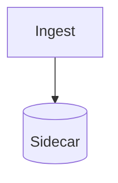

# SymDraw — implementation proposal

SymDraw is the diagram and graphics counterpart to SymPrint: SymPrint turns a
Markdown document into a typeset PDF, SymDraw turns a diagram source into a
vector graphic that lands in the vault as an asset and can be embedded in any
document. Like SymPrint it is a library inside `symdesk`, reachable from the
CLI, the MCP server, the self-hosted API and both native apps.

Status: proposal. Nothing here is implemented yet.

## 1. Why SymDraw

A Markdown vault accumulates diagrams — architecture sketches, sequence flows,
project timelines, charts over saved views. Today they are either code fences
that no export can render, or opaque PNGs pasted in from somewhere else. Both
break the vault contract: the first is not a picture, the second is not text.

SymDraw closes that gap on the vault's own terms. The diagram *source* stays
plain text inside the vault, so it is searchable, diffable, linkable and
covered by permissions and retention. The rendered graphic is a derived
artifact, regenerable at any time — the same relationship the SQLite sidecar
has to the Markdown files.

## 2. Constraints

These come from the repository and are not negotiable for this component:

- **CGO-free.** `CGO_ENABLED=0` holds in test and release paths; GoReleaser
  cross-compilation depends on it.
- **Fully offline.** No headless browser, no Node runtime, no network at
  render time.
- **Markdown is the SSOT.** The rendered graphic must never be the only place
  a diagram exists.
- **Zero stdio pollution** on the MCP path.
- **No separate SPA/TS frontend** (`docs/BROWSER-ACCESS.md`). Anything
  interactive is native SwiftUI or server-rendered HTML.
- **Deterministic output**, because SymPrint already guarantees
  machine-independent PDFs and a diagram inside one must not break that.

## 3. Decision: build the pipeline, do not wrap an engine

The obvious path is to link an existing Go diagram engine. It was evaluated
and rejected as the primary path:

| Candidate | In-process, CGO-free | Maturity | Verdict |
| :--- | :--- | :--- | :--- |
| D2 (`oss.terrastruct.com/d2`) | SVG yes | production, MPL-2.0 | rejected as primary — see below |
| Graphviz (`goccy/go-graphviz`) | yes, WASM via wazero | mature, MIT (+EPL wasm) | possible future DOT importer |
| `zkrebbekx/go-mermaid` | yes | pre-1.0, 4 stars, no tags | not load-bearing |
| `yashikota/mermaigo` | yes | 0 stars, 8 commits | not load-bearing |
| `dreampuf/mermaid.go` | no — chromedp | mature | violates offline/CGO-free |
| Manim | no — Python, ffmpeg, LaTeX | mature | out of scope entirely |

D2 fails three of the constraints in combination: **PNG and PDF export require
Playwright**, i.e. a downloaded headless browser, so raster output would not be
offline; its `go.mod` requires a newer Go directive than the root module; and
its styling model cannot be reconciled with SymairaTheme and the SymPrint
profiles without fighting it. The mermaid ports are too immature to carry a
production feature.

More importantly, wrapping any of them forfeits the things that make this
worth building: vault-aware nodes, live diagrams over saved views, one theme
shared with the PDF profiles, and the security property in §11.

**The hard part is already solved in this repository.** The central problem of
browser-free diagram rendering is text measurement — node sizes and therefore
the entire layout depend on knowing the exact width of a label. Two facts make
this cheap here:

- `golang.org/x/image` is already a direct dependency and provides
  `font/sfnt` (glyph advances *and* outlines) and `vector` (a pure-Go
  antialiasing rasterizer).
- SymPrint already embeds `Inter-Regular.ttf` and `Inter-Bold.ttf` in
  `print/internal/assets/fonts/` and passes typst `--font-path` plus
  `--ignore-system-fonts` specifically to make output machine-independent.

A spike against those exact font files confirms the approach:

```
font: Inter Regular  upem: 2048  glyphs: 2937
  "Datenbank-Migration"   width @14pt = 140.17px
  "Kundenprojekt Alpha"   width @14pt = 138.70px
  outline of 'g': 40 segments
  ascent=13.56  descent=3.38  lineheight=16.94
```

Exact advances, exact outlines, exact vertical metrics — in pure Go, offline,
against the same font that will later set the PDF. This is the property no
external engine can offer: preview, app and PDF agree metrically because they
measure with one font file.

## 4. Architecture

```
Source   (Mermaid subset | SymDraw IR | vault query)
   | parse
IR       Graph | Sequence | Timeline | Tree | ChartSpec
   | measure    <- sfnt + Inter -> intrinsic node sizes
   | layout     <- per diagram kind
Scene    []Primitive{RoundRect, Path, PolyLine, Text, Marker} + Bounds + theme tokens
   | emit
   +-- SVG   (string emitter, no library)
   +-- PNG   (x/image/vector over the same Scene)
   +-- GIF   (stdlib image/gif over PNG frames)
   +-- Typst (optional, native vectors inside the PDF)
```

**`Scene` is the single choke point and the reason this is tractable.** Because
SymDraw owns the emitter, PNG is not SVG rasterization — it is a second backend
over the same positioned primitives. SymDraw therefore never needs an SVG
parser and never needs a general-purpose rasterizer. This is precisely where D2
has to reach for a browser and SymDraw does not. Animated GIF becomes nearly
free once the PNG backend exists.

Package layout, in the root module (see §12 on why not a nested module):

```
internal/draw/
  ir/        # input-independent diagram model + JSON schema
  parse/     # mermaid subset -> ir, ir JSON -> ir
  measure/   # sfnt text metrics, line breaking, intrinsic sizing
  layout/    # layered, tree, sequence, timeline, chart, force
  scene/     # positioned primitives, bounds, theme tokens
  emit/      # svg, png, gif, typst backends
  theme/     # SymairaTheme-derived palettes, light/dark, per SymPrint profile
```

The public entry point is `internal/draw` itself, mirroring how
`internal/pdf` fronts SymPrint: a narrow set of functions
(`Render`, `Validate`, `Kinds`) plus injectable seams so tests never need real
fonts on disk.

## 5. Input contract

Two input surfaces, deliberately no third DSL:

**Mermaid subset — for humans and LLMs.** Every model emits Mermaid fluently
with no prompt engineering, and it is already what sits in vaults. SymDraw
supports a documented, versioned subset. Unsupported constructs fail with a
typed error naming the construct and giving a hint, following the existing
`press.RenderError{Stage, Message, Hint}` shape. The subset is specified in a
contract document alongside `print/docs/markdown-contract.md`, not inferred
from the implementation.

**SymDraw IR — for agents.** Schema-validated JSON, no parser guessing:

```json
{
  "kind": "graph",
  "direction": "TD",
  "nodes": [
    {"id": "a", "label": "Ingest", "shape": "round", "note": "Projekte/Ingest.md"},
    {"id": "b", "label": "Sidecar", "shape": "cylinder"}
  ],
  "edges": [
    {"from": "a", "to": "b", "label": "derives", "style": "solid", "arrow": "single"}
  ],
  "groups": [{"label": "Core", "members": ["a", "b"]}]
}
```

Symaira-specific concerns — theme, output path, source query — live in the
document frontmatter, never in the diagram language.

## 6. Vault model

A diagram is a note. The rendered graphic is derived.

```markdown
---
type: diagram
engine: mermaid
theme: symaira-dark
output: assets/architektur.svg
---
# Systemarchitektur


```

Consequences, all of which fall out of the existing machinery:

- the *source* is indexed by FTS5, so diagrams are searchable by content
- the note is linkable, taggable, and covered by document permissions and
  retention rules
- git sees a text diff, not a binary blob
- `symdesk draw render --all` rebuilds every derived graphic, the same way the
  sidecar can be rebuilt from the vault

Embedding into another document is ordinary Markdown:
``. Nothing downstream needs to
know SymDraw exists.

Rendered graphics are **derived artifacts**: excluded from document indexing,
and reported by `vault_health` when orphaned (no source) or stale (source newer
than output).

### Vault-native behaviour

This is what justifies building rather than wrapping:

1. **Wikilink nodes.** `A[[Projekt Alpha]] --> B[[Kunde X]]` resolves the node
   to a vault note, emits a clickable `<a>` in the SVG, and records a real
   backlink in the sidecar. Diagrams become part of the vault graph instead of
   opaque pictures inside it.
2. **Live diagrams.** A `source:` key in the frontmatter points at a saved
   dbview or tag query; `internal/watcher` triggers a re-render when the vault
   changes.
3. **Contacts and meetings as node types**, via `relate/` and the meeting
   services.
4. **One theme** across preview, app and PDF, keyed to the SymPrint profiles
   (`behoerde`, `brief`, `meeting`, `report`).

## 7. Determinism contract

Byte-identical SVG for identical input unlocks git-readable diffs,
content-hash caching, golden-file tests as the primary test strategy, and
reproducible PDFs. It is cheap to design in and expensive to retrofit, so it
is a contract from the first commit:

- never range over a Go map directly — sort keys first
- fixed float formatting (`strconv.FormatFloat`, 2 decimals)
- no timestamps, no UUIDs, no random identifiers in output; element ids derive
  from node identity
- seeded RNG only, for the force-directed layout
- the font content hash is recorded in the output metadata, mirroring
  `assets.VersionKey()` in SymPrint

Golden SVG files are therefore the main test vehicle, complemented by property
tests for layout invariants: no node overlap, edges monotone across layers,
bounds contain every primitive.

## 8. Layout engines

One hard algorithm, five straightforward ones. This is the central scoping
fact:

| Layout | Method | Effort | Covers |
| :--- | :--- | :--- | :--- |
| **Layered (Sugiyama)** | greedy-FAS cycle break, longest-path layering, dummy nodes, barycenter + transpose crossing reduction, Brandes-Köpf x-coordinates, edge routing | **~2000 LOC — the hard part** | flowchart, state, ER, class, dependency |
| Tidy tree | Reingold-Tilford / Walker | ~250 LOC, exact | mindmap, org chart, decision tree |
| Sequence | closed form: lifelines are columns, messages are rows | ~200 LOC | sequence diagram |
| Timeline / Gantt | closed form: time axis to x, lanes to y | ~200 LOC | roadmap, project plan |
| Chart | nice-number ticks, scales, marks | ~400 LOC | bar, line, pie, scatter |
| Force-directed | Fruchterman-Reingold, seeded | ~200 LOC | vault graph |

Total realistic size including tests is 6000-8000 lines of production Go —
comparable to `internal/service`. This is a project, not a weekend build, and
the staging in §13 reflects that.

## 9. Surfaces

| Surface | Shape |
| :--- | :--- |
| CLI | `symdesk draw render \| validate \| kinds \| rerender`, in the Document family |
| MCP | `draw_kinds`, `draw_validate` (read-only); `draw_render`, `draw_insert`, `draw_from_view`, `draw_graph` (mutating) |
| HTTP | `POST /api/v1/draw/render`; delivery already works via `GET /api/v1/files` |
| macOS / iOS | source-and-preview split view, "insert as asset" in the Markdown editor |
| Skill | `SKILL.md` bundle installable through the skills manager in `symbrain` |

MCP tools are registered as `tools.Tool` in `internal/tools`, so they reach the
stdio MCP server and the in-process AI loop from one definition.

The skill matters more than it looks: external agents need dialect knowledge —
which kind to pick, what the subset supports, which themes exist — not just
tool schemas.

## 10. Theming

Diagram colours are document colours, not UI chrome, so Go is the SSOT for
them. The palette mirrors `SymairaTheme` in `symaira-appkit`, which today
exists only as Swift hex constants. A test pins the hex values so drift becomes
visible; generating twelve colours through a codegen pipeline would cost more
than it saves.

Text is emitted as `<text font-family="Inter">` with a fallback stack **and an
explicit `textLength`** computed from our own metrics, so a viewer without Inter
stretches to the correct box instead of destroying the layout. A
`--text-as-paths` mode emits glyph outlines instead, for contexts where font
resolution cannot be guaranteed (see §15).

## 11. Security

Building the renderer removes a class of problem rather than adding one.

In a wrapper design the AI would generate free-form SVG, which would then have
to be sanitised on the way into the vault — a permanent attack surface, since
SVG carries scripts, external references and foreign objects. Here the AI
generates **IR or Mermaid**, and SymDraw generates the SVG. No third-party SVG
enters the system, so no sanitiser is needed.

The self-hosted server is already covered on the delivery side: the
`securityHeaders` middleware sets `Content-Security-Policy: default-src 'none'`
and `X-Content-Type-Options: nosniff`, and that also applies to the
unauthenticated `GET /s/{token}` share route which serves files inline. This
should be verified once against a hostile SVG fixture before launch, as a
regression test rather than an assumption.

If SVG *import* is ever added (`.drawio`, `.excalidraw`), the sanitiser
question returns and needs its own proposal.

## 12. Prerequisites

Three gaps sit between the current state and a working diagram-in-document
path. All three are independent defects worth fixing regardless of SymDraw:

1. **PDF export cannot resolve local images at all.** `internal/pdf.Render`
   calls `printapi.Render` with `Options{Profile: profile}` and never sets
   `SourceDir`. In `print/internal/press/assets.go` an empty `SourceDir` makes
   every `` a hard error — *"image reference cannot be
   resolved: the input has no source directory"*. Any note with a local image
   currently fails PDF export.
2. **The Go core cannot write vault assets.** Collision-safe naming,
   sanitising and atomic writes exist only in Swift
   (`Sources/SymDeskCore/VaultAssets.swift`). No MCP agent can place a binary
   file in the vault today. The Swift side should consume the Go
   implementation afterwards rather than keep a second one.
3. **Sidecar and health checks have no notion of derived artifacts** — no
   index exclusion, no stale/orphan reporting.

SymDraw lives in `internal/draw/` in the root module, not as a nested module.
The nested modules (`print/`, `seek/`, `relate/`, `room/`, `ingest/`) exist
because those repositories were absorbed; their `go.mod` files state the intent
"so each stays independently buildable and testable". That intent is being
re-examined separately. A new component should not add a sixth module graph to
a repository that is consolidating.

## 13. Implementation stages

| Stage | Content | Why here |
| :--- | :--- | :--- |
| **0** | The three prerequisites in §12 | independent value; without them no graphic reaches a PDF |
| **A** | IR, measure, Scene, SVG + PNG emitters, theme — with **charts** as the first kind | validates the whole pipeline on the cheapest layout and ships value immediately via dbviews |
| **B** | Layered engine + Mermaid flowchart subset | the hard part, on seams already proven by stage A |
| **C** | Sequence, timeline, tree | cheap, highly visible |
| **D** | Wikilink nodes, vault graph, live diagrams, MCP tools, `SKILL.md` | the vault-native payoff |
| **E** | Animation as step sequences; canvas editing (see §14) | only after the static path is solid |

Starting with charts rather than the flowchart is deliberate: the pipeline must
prove itself on something cheap before the expensive layout work begins.

## 14. What this does not do

- **No canvas or whiteboard editing, and this proposal does not overturn the
  Obsidian Canvas decision** at the top of `docs/ARCHITECTURE.md`. That
  decision asks for a separate proposal covering read-only rendering,
  embedded-note resolution, offline assets and the link/index contract before
  any implementation starts. Stage E inherits that requirement: an interactive
  canvas would be native SwiftUI, would need its own proposal, and would not
  put a React editor into the browser surface.
- **No general SVG parser or rasterizer.** Only SymDraw's own Scene is
  rasterized.
- **No text shaper.** Inter's 2937 glyphs cover Latin, Greek and Cyrillic.
  Arabic, Devanagari and CJK need shaping or different fonts and are a known,
  named gap — not something that silently renders wrong.
- **No Manim equivalent.** Animation means step sequences over one Scene,
  emitted as CSS-keyframe SVG, GIF frames, or a multi-page PDF via SymPrint.
- **No `.drawio` / `.excalidraw` import** in this proposal. Possible later,
  with the sanitiser question reopened.

## 15. Open risks and verified findings

1. **Does typst resolve `font-family` in an embedded SVG? (Verified: YES)**
   Spike and regression fixture tests (#532, `print/internal/press/svg_font_test.go`)
   confirm that Typst's SVG pipeline resolves `font-family="Inter"` (and
   `font-weight="bold"`, CSS inline `style=...`) against fonts provided via
   `--font-path`, even with `--ignore-system-fonts` enabled.

   **Font-family resolution vs. path outlines:**
   - *Font-family resolution* (`<text font-family="Inter">` with fallback stack)
     is the primary, preferred emitter mode. Typst matches the Inter font family,
     subsets the glyphs, and embeds real Type0/CIDFontType2 vector fonts into the
     output PDF. Text remains fully searchable, selectable, and accessible
     (with valid ToUnicode CMaps and screen-reader compatibility), yielding
     significantly smaller SVG asset sizes and crisp PDF vector text.
   - *Path outlines* (`--text-as-paths` via `golang.org/x/image/font/sfnt`) remain
     available as an optional export mode for external consumers (e.g. standalone
     web viewers or third-party tools that lack local Inter font installations),
     but are not required or recommended for the SymPrint Typst PDF pipeline.
2. **Font SSOT across the module boundary.** The TTFs live in
   `print/internal/` and are not importable from the root module. The clean fix
   is an accessor on `print/api` (`Fonts() fs.FS`); copying the files would
   create drift between the diagram's metrics and the PDF's. If the nested
   modules are dissolved (§12) this resolves itself.
