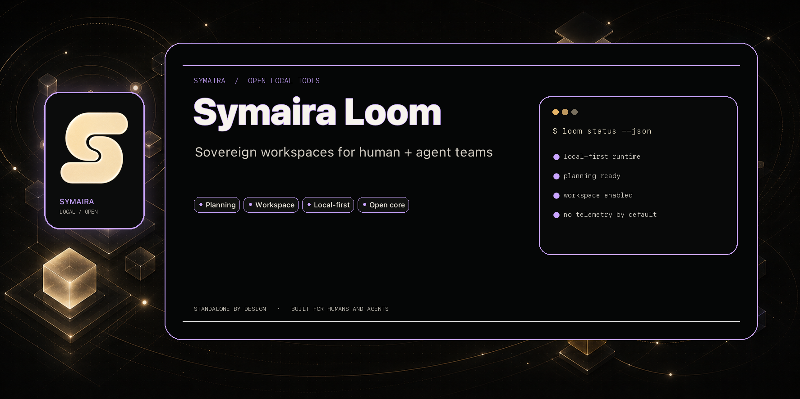

# Symaira Loom (archived — absorbed into symaira-desktop)

> **Moved 2026-08-20** as part of the Symaira repo consolidation (27 → 13,
> see `Dev/Symaira Dev/docs/repo-konsolidierung.md` §3.2). This directory holds
> the product and brand layer of the former
> [`danieljustus/symaira-loom`](https://github.com/danieljustus/symaira-loom)
> repository, now archived — its full history remains there.

**The product and brand layer for the sovereign, file-based workspace where
humans and their AI agents collaborate — signed, local, with human approval
for consequential actions.**

Symaira Loom defines what the workspace _is_: its identity, its promises, and
its boundaries. It does not contain the implementation — that lives in
[symaira-room](https://github.com/danieljustus/symaira-room) (`symroom`).

Loom is for anyone building or using an AI-augmented workspace who cares about
auditability, local-first operation, and explicit human gates. It is the
contract between the product and the people who rely on it.

---

## What lives here

|Area|Path|Notes|
|---|---|---|
|Brand assets|[`assets/branding/`](assets/branding/)|Logos, color palette, typography|
|Social preview|[`assets/social-preview.png`](assets/social-preview.png)|OpenGraph / Twitter card image|
|Technical planning|[`PLAN.md`](PLAN.md)|Product, architecture & validation planning (2026-07-27)|
|Release history|[`CHANGELOG.md`](CHANGELOG.md)|SemVer release notes|

## Where is the code?

The actual workspace implementation (room layer, journal, gates) lives in the
[symaira-room](https://github.com/danieljustus/symaira-room) repository.
This repo is deliberately code-free — a decision made on 2026-07-27.

## Release process

Releases follow SemVer. Before a release, the security and prerequisite gates
in the Symaira workflow must pass. See the
[CHANGELOG](CHANGELOG.md) for version history.

---

## Deutscher Abschnitt

Loom ist die Produkt- und Markenklammer für den souveränen, dateibasierten
Arbeitsraum, in dem Menschen und ihre KI-Agenten zusammenarbeiten — signiert,
lokal, mit menschlicher Freigabe für folgenreiche Aktionen.

**Dieses Repository enthält bewusst keinen eigenen Code.** Entschieden am
2026-07-27: Loom ist Marke und Produktversprechen, keine eigene Codebasis.
Die tatsächliche Umsetzung (Raumschicht, Journal, Gates) erfolgt in
[symaira-room](https://github.com/danieljustus/symaira-room) (`symroom`).

Die Produkt-, Architektur- und Validierungsplanung liegt lokal unter
`docs/PLAN.md` (nicht versioniert, siehe `.gitignore`). Die technische Tiefe
der Raumschicht steht in `../symaira-room/docs/PLAN.md`.

---

## License

Licensed under the [Apache License, Version 2.0](LICENSE).
